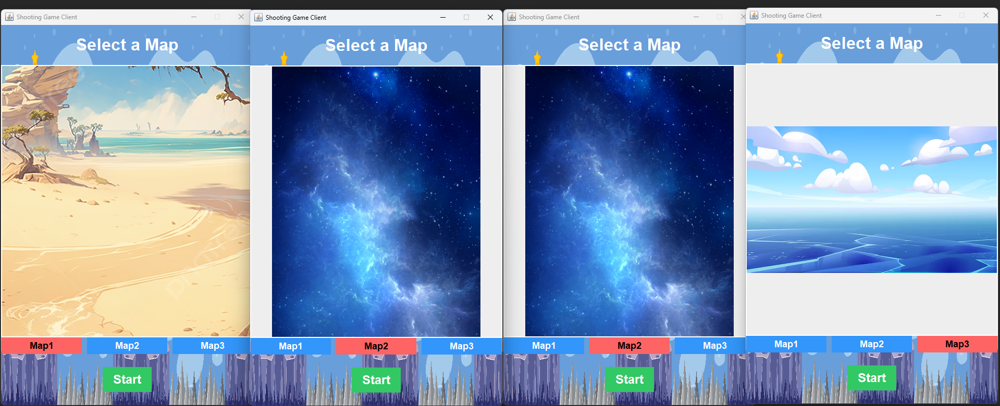
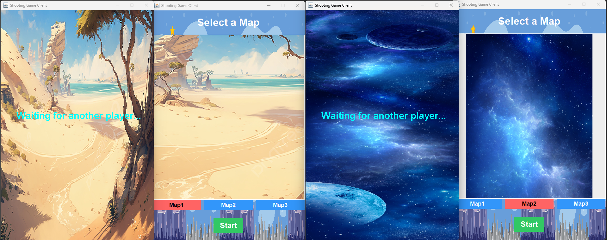
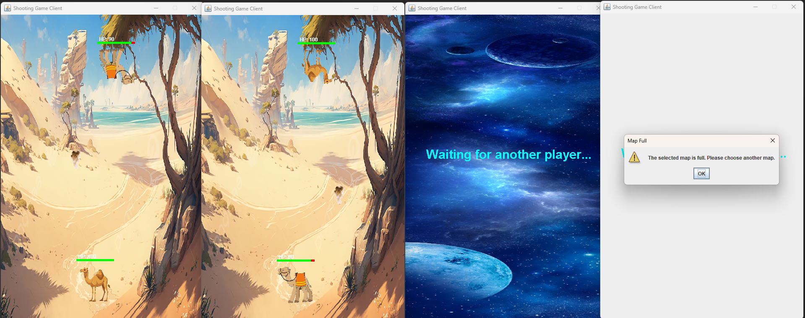
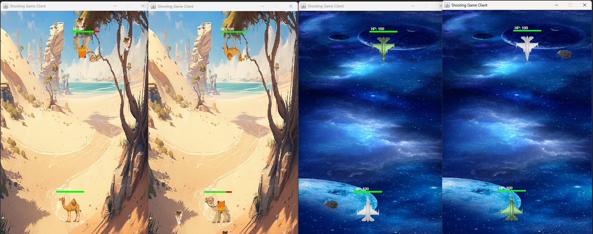
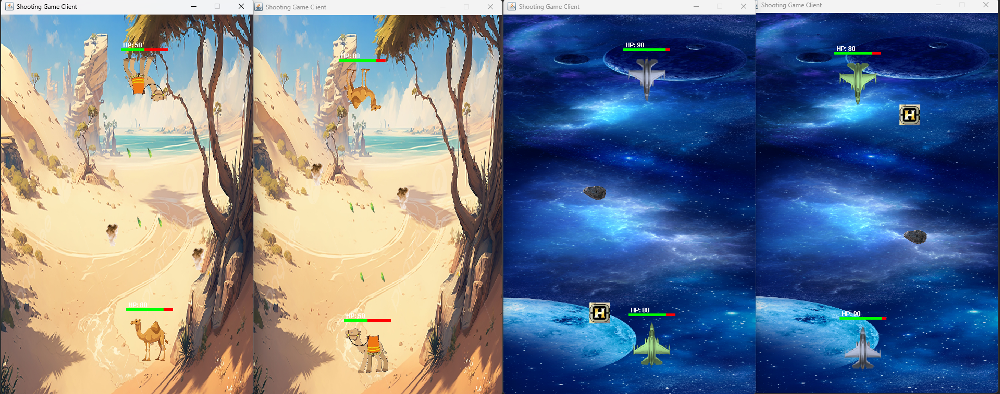
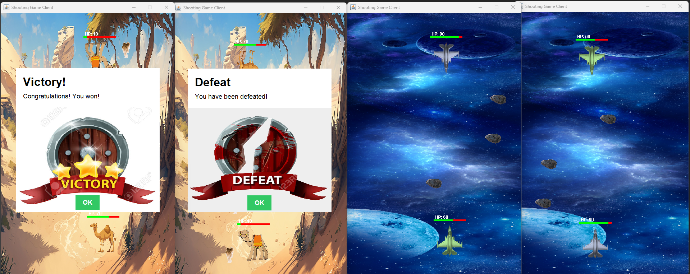

# 🎮 Java Socket Shooting Game

Java Socket 통신을 기반으로 한 **실시간 1:1 멀티플레이 미사일 슈팅 게임**입니다.  
서버 중심(authoritative) 구조를 통해 게임 상태를 관리하며,  
두 플레이어는 **대칭 시점(Mirror View)** 으로 동일한 게임 환경을 경험합니다.

---

## 📌 프로젝트 개요

본 프로젝트는 TCP Socket 기반의 Client–Server 구조를 사용하여  
두 명의 플레이어가 실시간으로 대전하는 1:1 슈팅 게임을 구현한 프로젝트입니다.

- 맵 선택 기반 방 생성
- 맵당 최대 2명 입장
- 2명 모두 접속 시 자동 게임 시작
- 게임 중인 방은 추가 접속 불가
- 서버 기준 충돌 판정 및 상태 동기화

---

## 🛠 사용 기술

| 구분 | 기술 |
|----|----|
| Language | Java |
| Network | TCP Socket |
| UI | Java Swing |
| Concurrency | Thread, ScheduledExecutorService |
| Architecture | Client–Server |
| Rendering | Double Buffering |
| Game Logic | Server Authoritative |

---

## 📁 Project Structure

```text
ShootingGame/
 ┣ 📂 images/                 # 배경, 플레이어, 미사일, 장애물, 아이템 이미지
 ┣ 📂 src/
 ┃ ┣ Item.java                # 아이템 엔티티
 ┃ ┣ ItemManager.java         # 아이템 생성 및 이동 관리
 ┃ ┣ Missile.java             # 미사일 엔티티
 ┃ ┣ Obstacle.java            # 장애물 엔티티
 ┃ ┣ ObstacleManager.java     # 장애물 생성 및 이동 관리
 ┃ ┣ Player.java              # 플레이어 상태 및 정보
 ┃ ┣ ShootingGameClient.java  # 클라이언트 (렌더링, 입력 처리)
 ┃ ┣ ShootingGameServer.java  # 서버 실행 진입점
 ┃ ┣ ClientHandler.java       # 클라이언트 요청 처리 스레드
 ┃ ┣ MapInstance.java         # 맵 단위 게임 로직
 ┃ ┗ MapManager.java          # 맵 생성 및 플레이어 배정
 ┣ 📄 README.md
 ┣ 📄 .gitignore
 ┗ 📄 IDE 설정 파일
```

## 🎯 주요 기능

### 🗺 맵 선택 화면


- 플레이어는 접속 후 **Map1 / Map2 / Map3** 중 하나를 선택한다.
- 각 맵은 서로 다른 **배경 및 오브젝트 테마**를 가진다.

---

### ⏳ 대기 화면 (1명 접속 시)


- 한 명만 접속한 경우, 게임은 시작되지 않고 **대기 상태**로 유지된다.
- 서버는 해당 맵을 **대기 상태(Room Waiting)** 로 관리한다.

> 실시간 동기화 및 서버 중심 맵 관리 구조를 확인할 수 있는 화면

---

### 🚫 다른 방 참가 불가


- 이미 게임이 진행 중인 맵에는 **추가 참가가 불가능**하다.
- 서버에서 맵 상태를 검사하여 **클라이언트 요청을 차단**한다.

> ✔️ 서버 중심 설계(Server Authoritative)

---

### 🎮 게임 시작 화면 (대칭 시점)


- 두 명의 플레이어가 모두 준비되면 게임이 **자동으로 시작**된다.
- 각 플레이어는 **자신을 기준으로 항상 화면 하단**에서 플레이한다.
- 상대 플레이어는 서버에서 **좌표를 대칭 변환(Mirror View)** 하여 전송된다.

> 👉 본 프로젝트의 **핵심 설계 포인트**

---

### 🎁 아이템 획득


- 아이템 획득 시 일정 시간 동안 **더블 미사일 효과**가 적용된다.
- 아이템 효과의 시작과 종료는 **서버 타이머**로 관리된다.

---

### 🏁 승리 / 패배 처리


- 플레이어의 **HP가 0 이하**가 되면 게임이 종료된다.
- 서버에서 승패를 판정하여 각 클라이언트에 **결과 화면**을 전송한다.

